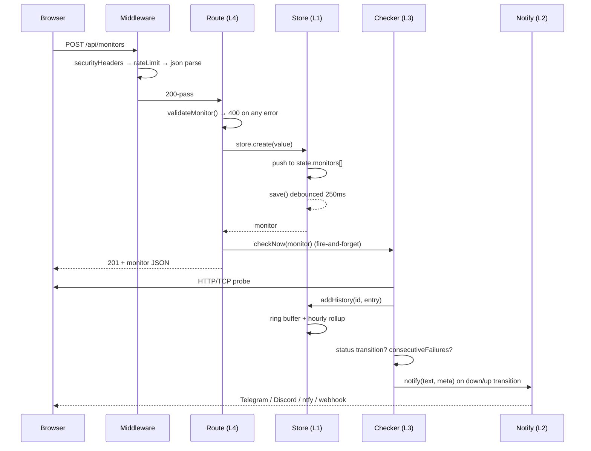
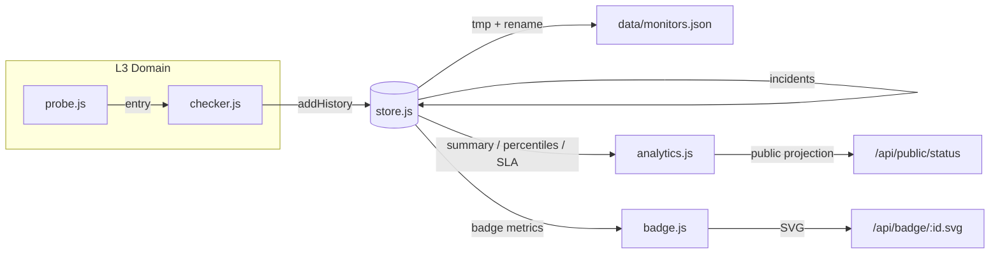
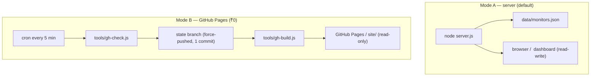

# 📐 NovaPulse — Architecture

> High-level design, the 5-layer model, and the diagrams that describe them.
> This file answers *"how is it put together and why that shape"* — not *"how
> do I run it"* (that is the README) nor *"what is the schema"* (that is
> [`DATABASE.md`](DATABASE.md)).

---

## 1 · Design constraints (the inputs that shaped everything)

| constraint | consequence |
| --- | --- |
| Must run free-tier, forever, without a card | no database, no Redis, no build step |
| Must survive a container restart with state intact | one JSON file on a mounted volume |
| Must serve 100s of checks from ~60 MB RAM | fixed-size rollups, ring buffers |
| CSP without `unsafe-inline` | no inline scripts → build-time mode switch |
| Single writer | `instances: 1` in PM2; never scaled horizontally |
| 2 runtime dependencies | hand-rolled rate limiting, badges, charts, alerts |

**The shape of the system is a direct consequence of these constraints.**
Any proposal that violates one of them needs an ADR
([`DECISIONS.md`](DECISIONS.md)).

---

## 2 · The 5-layer model

```
┌────────────────────────────────────────────────────────────────────┐
│ L5  PRESENTATION      public/  · site/ (static build)             │
│     Vanilla ES modules, no framework, no bundler. Hash routing.    │
│     Escape hatch: everything renders through h() → text:/html:      │
├────────────────────────────────────────────────────────────────────┤
│ L4  APPLICATION       server.js  → createApp()                    │
│     Route table, request validation, security headers, rate limit, │
│     error envelope. Contains NO business logic — it delegates down. │
├────────────────────────────────────────────────────────────────────┤
│ L3  DOMAIN            lib/checker · lib/probe · lib/analytics     │
│     Scheduling, HTTP/TCP probing, percentile & SLA math,           │
│     status projection. Pure-ish functions, independently testable.  │
├────────────────────────────────────────────────────────────────────┤
│ L2  INTEGRATION       lib/notify  ·  lib/badge  ·  lib/logger      │
│     Outbound fan-out (Telegram/Discord/ntfy/webhook), SVG render,  │
│     structured logging. Zero dependencies — plain fetch + string.   │
├────────────────────────────────────────────────────────────────────┤
│ L1  PERSISTENCE       lib/store                                     │
│     One file, atomic tmp+rename, bounded ring buffers, in-memory    │
│     state, debounced flush. The only module allowed to touch disk.  │
└────────────────────────────────────────────────────────────────────┘
```

### The dependency rule (strict, enforced by review)

> **A layer may only call downward.** L5 → L4 → L3 → L2 → L1.

Violations that are *specifically* forbidden:

- `public/**` importing anything server-side, or reaching past `/api`.
- `lib/store` knowing about HTTP (`req`/`res`) or notifications.
- `lib/notify` or `lib/badge` reading the disk directly (they get data passed in).
- `server.js` containing percentiles, probe logic, or SQL-ish query building.
- A new module requiring *upward* — if it does, the responsibility is misplaced.

---

## 3 · Request lifecycle (sequence)



Note the **`fire-and-forget`** on `checkNow`: the create response returns
immediately, so the UI never blocks on a live probe. The subsequent poll picks
up the result. This is why the toast says *"first check running now"*.

---

## 4 · Data flow (state)



**One direction only:** probes produce entries, the store folds entries into
bounded aggregates, everything else *reads* the store. No module writes to
disk except `lib/store`, and no module recomputes what the store already
pre-aggregated.

---

## 5 · Runtime modes



| | mode A | mode B |
| --- | --- | --- |
| state | `data/monitors.json` | `state` git branch |
| checks | in-process scheduler | Actions cron |
| UI | read-write | read-only (`APP_MODE = 'static'`) |
| alerts | from the server | from the Actions runner |
| cost | needs a host | ₹0, never sleeps |

The switch is `public/js/config.js` → `APP_MODE`, rewritten at build time.
It is **never** detected at runtime: the CSP forbids inline scripts, and a
runtime sniff would let a stale service worker report the wrong mode.

---

## 6 · Frontend rendering contract

Every DOM node is built through `h()` from `public/js/ui.js`:

| prop | meaning | rule |
| --- | --- | --- |
| `text:` | sets `textContent` | safe for **any** input, use by default |
| `html:` | sets `innerHTML` | **trusted static markup only**, never user data |

This is the single choke point that makes **L-14** enforceable by inspection:
there is exactly one `innerHTML` assignment path in the app, and it is not
reachable from user input. `escapeHtml()` exists for the rare case where a
string must be interpolated into trusted markup.

Overlay/focus handling is centralised in `mountOverlay()` — one active
overlay, focus trap, `Esc` to close, focus restored on close. Individual views
never implement their own focus management.

---

## 7 · Failure & shutdown semantics

| event | behaviour |
| --- | --- |
| probe timeout | entry recorded as failed; `failuresBeforeDown` grace prevents flap |
| store write fails | logged as `error`; **previous state file remains intact** (tmp+rename) |
| data file unreadable at boot | logged + start empty (ENOENT) vs **fail-closed** on security errors |
| `SIGINT`/`SIGTERM` | stop scheduler → close server → `store.save(true)` flush → exit |
| unhandled rejection | logged, process keeps serving (the checker loop is supervised) |
| alert channel down | logged per-channel; never blocks the probe loop |

The asymmetry is deliberate and follows **L-09**: *availability* problems
degrade, *security* problems halt.

---

## 8 · Where to change what

| you want to… | touch | layer |
| --- | --- | --- |
| add an endpoint | `server.js` | L4 |
| add/alter a check type | `lib/probe.js` | L3 |
| change percentile/SLA math | `lib/analytics.js` | L3 |
| change scheduling/grace | `lib/checker.js` | L3 |
| add an alert channel | `lib/notify.js` | L2 |
| change stored shape | `lib/store.js` **+** `DATABASE.md` | L1 |
| change a screen | `public/js/views.js` | L5 |
| change the DOM primitives | `public/js/ui.js` | L5 |
| add a gate | `.github/workflows/` | — |

---

## 9 · Deliberate omissions

Recording these prevents them from being "helpfully" added later:

- **No database.** Not needed until multiple replicas or multi-user; the
  export format is lossless, so migration is a one-way, safe step.
- **No framework.** React/Vue would add a build step and a hydration cost to
  a dashboard that re-renders from JSON every few seconds.
- **No WebSocket.** Polling at 5–30 s is simpler, proxies-friendly, and the
  data itself only changes when a probe completes.
- **No auth on `/status`.** It is public by design; the payload is an
  allowlist with no secrets (tested by `e2e/status-page.spec.mjs`).
- **No horizontal scaling.** The store is single-writer by contract (**L-39**).
