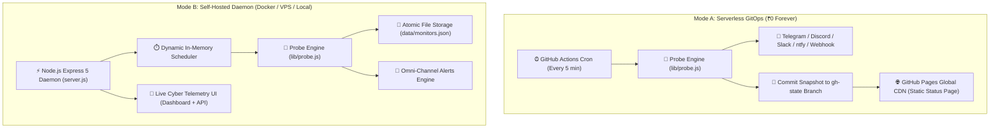
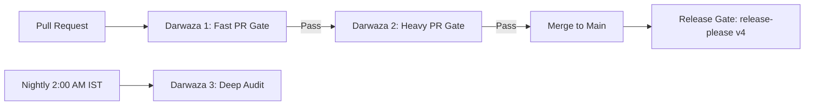

# <p align="center"> <br/>⚡ NovaPulse 2026</p>

<div align="center">

### **Next-Gen Autonomous GitOps Uptime & Incident Telemetry Platform**
*100% Free-Tier Forever · Zero External Database · Zero Credit Cards · Zero Maintenance*

<br/>

[](https://github.com/SudhirDevOps1/NovaPulse/actions/workflows/ci.yml)
[](https://github.com/SudhirDevOps1/NovaPulse/actions/workflows/e2e-gate.yml)
[](https://github.com/SudhirDevOps1/NovaPulse/actions/workflows/security-scan.yml)
[](https://sonarcloud.io/summary/new_code?id=SudhirDevOps1_NovaPulse)
[](LICENSE)
[](https://github.com/SudhirDevOps1/NovaPulse/stargazers)

<br/>

[](https://nodejs.org/)
[](https://expressjs.com/)
[](https://www.docker.com/)
[](https://github.com/features/actions)
[](https://playwright.dev/)
[](https://codeql.github.com/)

<br/>

🌐 **[Live Status Page](https://sudhirdevops1.github.io/NovaPulse/status.html)** • 
🧡 **[Cloudflare Edge Guide](docs/CLOUDFLARE_EDGE_DEPLOYMENT.md)** • 
🐙 **[Upptime Issues Guide](docs/UPPTIME_GITHUB_ISSUES_INTEGRATION.md)** • 
▲ **[Vercel & Turso/Neon Guide](docs/TURSO_NEON_VERCEL_SETUP.md)** • 
⏱️ **[24/7 Deployment Guide](docs/PERSISTENT_247_DEPLOYMENT.md)** • 
📘 **[Getting Started](docs/GETTING_STARTED.md)** • 
🛠️ **[Developer Guide](docs/DEVELOPER_GUIDE.md)** • 
📐 **[Architecture Guide](.ai/ARCHITECTURE.md)** • 
📜 **[Golden Laws](.ai/RULES.md)** • 
🐛 **[Bug Register](.ai/BUGS.md)** • 
📝 **[Changelog](.ai/CHANGELOG.md)** • 
🚀 **[Quickstart](#-quickstart)** • 
🔌 **[REST API](#-rest-api-reference)**

<br/>

### **One-Click Zero-Config Cloud & Edge Deployment**

[](https://deploy.workers.cloudflare.com/?url=https://github.com/SudhirDevOps1/NovaPulse)
[](https://vercel.com/new/clone?repository-url=https://github.com/SudhirDevOps1/NovaPulse)
[](https://app.netlify.com/start/deploy?repository=https://github.com/SudhirDevOps1/NovaPulse)
[](https://render.com/deploy?repo=https://github.com/SudhirDevOps1/NovaPulse)
[](https://railway.app/new)

</div>

---

## ⚔️ The Multi-Platform Feature Matrix

| Feature | Standard Upptime | Pingflare / UptimeFlare | Uptime Kuma | UptimeRobot | ⚡ **NovaPulse 2026** |
| :--- | :--- | :--- | :--- | :--- | :--- |
| **Execution Engine** | GitHub Actions (delays up to 45m) | Cloudflare Worker (1m edge) | Node.js Daemon (VPS) | Proprietary Cloud | 🏆 **Hybrid Edge + Worker + Docker + Actions** |
| **Downtime Auto-Issues** | ✅ GitHub Issues | ❌ | ❌ | ❌ | 🏆 **✅ Upptime-Grade Auto Issues & Auto-Close** |
| **Database Freedom** | Git commits only | Cloudflare D1 / KV | Local SQLite only | Proprietary | 🏆 **D1 · Turso · Neon · Aiven · Git · JSON** |
| **Visual Telemetry** | ❌ | ❌ | ❌ | ❌ | 🏆 **Google Maps Platform 3D Edge Pins** |
| **Screenshot Previews** | ❌ | ❌ | ❌ | Paid Plan | 🏆 **✅ Automated Headless Snapshots** |
| **100% Free Forever** | ✅ (runner mins limit) | ✅ (100k req/day free) | ❌ (requires VPS) | ❌ (50 monitors limit) | 🏆 **✅ 100% Free Tier Forever (₹0 / $0)** |

---

## 🧭 Table of Contents

- [🌟 Why NovaPulse?](#-why-novapulse)
- [🏗️ Dual-Runtime Architecture](#️-dual-runtime-architecture)
- [🚀 Key Features](#-key-features)
  - [📡 Multi-Protocol Probing Engine](#-multi-protocol-probing-engine)
  - [📸 Visual Screenshots & Error Diagnostics](#-visual-screenshots--error-diagnostics-better-stack-grade)
  - [📊 2026 Telemetry & Analytics](#-2026-telemetry--analytics-server-computed)
  - [🔔 Omni-Channel Alert Engine](#-omni-channel-alert-engine-zero-dependencies)
  - [🎨 Cyber Telemetry Dashboard UI/UX](#-cyber-telemetry-dashboard-uiux)
- [🥊 NovaPulse vs. The Incumbents](#-novapulse-vs-the-incumbents)
- [⚡ Quickstart](#-quickstart)
  - [Option A: Serverless GitOps Mode (₹0 Forever)](#option-a-serverless-gitops-mode-0-forever-zero-card-)
  - [Option B: Local / Docker / VPS Mode](#option-b-local--docker--vps-mode)
  - [Option C: Free Cloud Deployment (Render, Fly.io, PM2)](#option-c-free-cloud-deployment-recipes)
  - [⏱️ 24/7 Continuous Monitoring & Cron Lag Fix](docs/PERSISTENT_247_DEPLOYMENT.md)
  - [🩺 Monitoring Operations Guide](docs/MONITORING.md)
- [🛡️ The 3-Darwaza Safety Pipeline](#️-the-3-darwaza-safety-pipeline)
- [⚙️ Configuration Reference](#️-configuration-reference)
- [📐 Enforced System Limits](#-enforced-system-limits)
- [📚 REST API Reference](#-rest-api-reference)
- [💾 Backup & Disaster Recovery](#-backup--disaster-recovery)
- [🤝 Contributing & Governance](#-contributing--governance)
- [📄 License](#-license)

---

## 🌟 Why NovaPulse?

Traditional monitoring tools force an impossible compromise: either pay **\$30–\$100/month** for SaaS subscriptions (*UptimeRobot, Better Stack*), or manage heavy self-hosted databases, Redis instances, and complex Docker clusters that crash free-tier VPS servers (*Uptime Kuma, Zabbix*).

**NovaPulse 2026 redefines observability.** It runs as a **single featherweight Node.js process** (≈60 MB RAM) or as a **100% serverless GitOps engine** inside GitHub Actions and GitHub Pages.

```
┌───────────────────────────────────────────────────────────────────────────┐
│                        NOVAPULSE DUAL-RUNTIME MODEL                       │
├─────────────────────────────────────┬─────────────────────────────────────┤
│   MODE A: GITOPS SERVERLESS (₹0)    │     MODE B: DOCKER / NODE DAEMON    │
│  • Engine: GitHub Actions (5m cron) │  • Engine: Single-process Express 5 │
│  • Storage: `gh-state/` git branch  │  • Storage: `data/monitors.json`    │
│  • Hosting: GitHub Pages global CDN │  • Hosting: Docker, VPS, or Render  │
│  • Cadence: Every 5 minutes         │  • Cadence: Real-time (10s – 86400s)│
│  • Cost: ₹0 forever, 0 cards needed │  • Footprint: ~60 MB RAM, 0 DBs     │
└─────────────────────────────────────┴─────────────────────────────────────┘
```

---

## 🏗️ Dual-Runtime Architecture



---

## 🚀 Key Features

### 📡 Multi-Protocol Probing Engine
- 🌐 **HTTP & HTTPS Deep Verification**: Status code ranges (`200-299, 304`), custom HTTP methods (`GET`, `POST`, `HEAD`, `PUT`, `PATCH`, `DELETE`), custom headers, and request body payloads.
- 🔍 **Keyword & Content Assertions**: Validates that response bodies contain expected keywords (e.g., `"status":"ok"`). Catches silent application crashes returning 200 HTTP codes.
- 🔒 **SSL / TLS Certificate Expiry Watch**: Inspects live TLS sockets, reporting certificate issuer and days remaining. Triggers advance warning alerts before expiration without flipping monitor status to Down.
- 🔌 **TCP Raw Socket Port Checking**: Connects directly to socket ports (`tcp://db.internal:5432`, `tcp://mail.domain.com:587`) for databases, Redis instances, and background daemons.
- ⏱️ **Microsecond Timing Waterfall**: Exact breakdown per probe: `DNS` ➔ `Connect` ➔ `TLS Handshake` ➔ `TTFB` ➔ `Download`.

### 📸 Visual Screenshots & Error Diagnostics (Better Stack Grade)
- 🖼️ **Live Website Visual Snapshots**: every HTTP/HTTPS target gets a WordPress **mShots** preview (`s0.wp.com/mshots/v1/…`) — a free, third-party, best-effort service. Previews are generated lazily by your browser and are not captured by NovaPulse itself.
- 🗂️ **Interactive Incident Drawer**: thumbnail preview inside monitor details, with instant "Open website ↗" deep-links.
- 📝 **Raw Outage Response Body Snippets**: the first 1,024 bytes of a failing response are captured server-side and included in **alert messages** (first 200 bytes) and in the structured log, so you can see `502 Bad Gateway` or a `Database Connection Timed Out` page without opening the server.
- 🏷️ **Diagnostic Header Inspection**: `Server`, `Content-Type` and the other response headers are captured with the incident and logged.
- 🔒 **Snippets stay on the server**: neither the snippet nor the headers are returned by `GET /api/monitors` or `GET /api/incidents` — a probe that reads an internal service must not be able to hand its body back out over the API.

### 🗺️ Google Maps Platform Global Telemetry Map
- 🌍 **Interactive Reference Map**: plots seven labelled reference locations (Mumbai, Singapore, Frankfurt, London, San Jose, Ashburn, Tokyo) as basemap markers, plus one marker per monitor carrying its **real** name, URL, status and latency.
- 📍 **Requires `GOOGLE_MAPS_API_KEY`**: without one the card falls back to an explanatory banner and no Maps script is ever loaded. Marker *positions* are illustrative — NovaPulse does not geolocate a target, and each popup says so.
- 🛡️ **Terms & Tracking Compliant**: uses the modern Google Maps JavaScript API (`google.maps.marker.AdvancedMarkerElement`) with built-in attribution (`internalUsageAttributionIds: ["gmp_git_agentskills_v1"]`).

### 📊 2026 Telemetry & Analytics (Server-Computed)
- 📈 **Latency Percentiles**: Calculates `p50` (median), `p95` (peak), and `p99` percentiles across 24h, 7d, and 30d horizons.
- 🎯 **SLA Error Budgets**: Live SLA uptime percentage against target goals (e.g., `99.9%`), Error Budget remaining bar, incident counts, and MTTR (Mean Time to Resolution).
- 🟩 **Intraday & 30-Day Day-Cell Strips**: GitHub-style interactive visual history blocks with tooltips displaying uptime percentage, status codes, and check latency.
- 📊 **Response Distribution Histograms**: Visual bucket charts identifying latency jitter and network instability.

### 🔔 Omni-Channel Alert Engine (Zero Dependencies)
Dispatches instant notifications on state changes (`Down`, `Slow / Degraded`, and `Recovered` with outage duration):

| Channel | Badge | Description |
| :--- | :---: | :--- |
| **Telegram Bot** |  | Formatted Markdown messages with downtime duration and recovery indicators. |
| **Discord Webhook** |  | Rich color-coded embeds with status indicators. |
| **Slack Webhook** |  | BlockKit formatted alerts with interactive incident context. |
| **ntfy.sh Push** |  | Instant mobile push notifications via native Android & iOS apps. |
| **Custom Webhooks** |  | Compatible with n8n, Zapier, Webhook.site with HMAC signature verification (`x-novapulse-secret`). |

### 🎨 Cyber Telemetry Dashboard UI/UX
- 🌓 **OLED Dark & High-Contrast Light Themes**: Seamless theme switching with system auto-detection and zero layout shift.
- ⚡ **Optional Neon Cyber Mode (`⚡`)**: Topbar toggle activating glowing status rings, cyan telemetry lines, and futuristic card borders.
- 🎵 **Synthesized Audio Notification Chimes**: Synthesized Web Audio API sound feedback for saves, test checks, and outage events (zero external audio files).
- 🗂️ **Interactive Sliding Drawer**: Side drawer for in-depth metrics, CSV exports, pause/resume, and check triggers without breaking page layout.
- 🏷️ **Embeddable Shields.io Badges**: Live dynamic SVG badges (`/api/badge/:id.svg` and `/api/badge/fleet.svg`) in flat or `for-the-badge` styles ready for repository READMEs.

---

## 🥊 NovaPulse vs. The Incumbents

| Capability | ⚡ NovaPulse 2026 | 🐻 Uptime Kuma | 🤖 UptimeRobot | 🥞 Better Stack |
| :--- | :---: | :---: | :---: | :---: |
| **Pricing** | **🟢 100% Free Forever** | Free (Self-hosted) | \$8 – \$64 / mo | \$25 – \$190 / mo |
| **Credit Card Required** | **🟢 Never (₹0)** | Needs VPS | 🔴 Yes (for pro) | 🔴 Yes (for pro) |
| **Database Dependency** | **🟢 Zero (Atomic JSON)** | 🟡 SQLite / MariaDB | 🔴 Cloud DB | 🔴 Cloud DB |
| **RAM Footprint** | **🟢 ~60 MB RAM** | 🟡 ~300–600 MB RAM | N/A (SaaS) | N/A (SaaS) |
| **GitOps / Serverless Mode** | **🟢 Yes (Actions + Pages)** | ❌ No | ❌ No | ❌ No |
| **Latency Percentiles (p50/p95/p99)**| **🟢 Yes (Live Charts)** | ❌ No | Partial (avg only) | ✅ Yes |
| **SLA Budget & MTTR Tracking** | **🟢 Built-in** | ❌ No | ❌ No | 🟡 Paid Plan |
| **Timing Waterfall (DNS/TLS/TTFB)** | **🟢 Built-in** | ❌ No | ❌ No | 🟡 Paid Plan |
| **SSL Expiry Alerts** | **🟢 Built-in (14/21 days)** | ✅ Yes | 🟡 Paid Plan | ✅ Yes |
| **Degraded / Slow State Alerting** | **🟢 Built-in (`warnMs`)** | ❌ No | ❌ No | ✅ Yes |
| **Public Status Page** | **🟢 Included Free** | ✅ Included | 🟡 Limited / Paid | 🟡 Paid Plans |
| **Live SVG README Badges** | **🟢 Included Free** | ❌ No | 🟡 Paid Plan | 🟡 Paid Plan |
| **External NPM Runtime Deps** | **🟢 2 (`express`, `compression`)** | 🔴 40+ packages | N/A | N/A |

---

## ⚡ Quickstart

> 🔒 **Read this before you deploy.** NovaPulse has **no login**:
> * **Option B/C (Docker, VPS, Render …)** — anyone who can reach the port can
>   read, change and delete every monitor, backup and incident.
> * **Option A (GitHub Pages)** — the deployed site is **public**: every monitor
>   URL, its history, the incident timeline and the generated badges are readable
>   by anyone who has the link. Do not put credentials in monitor headers on a
>   public Pages deployment.
>
> Front both with something that authenticates (Cloudflare Access, OAuth2
> Proxy, Tailscale, a private network). Full threat model:
> [`docs/SECURITY.md`](docs/SECURITY.md).

### Option A: Serverless GitOps Mode (₹0 Forever, Zero Card) ⭐

Run monitoring entirely on GitHub infrastructure. GitHub Actions runs checks on cron; GitHub Pages hosts the dashboard. **Step-by-step with screenshots of every setting: [docs/GETTING_STARTED.md § Mode A](docs/GETTING_STARTED.md#4-mode-a--fork-and-deploy-on-github-0).**

1. **Get your own copy**:
   - **Fork it (recommended):** click **Fork** on GitHub, then in *your* fork open
     **Actions → «I understand my workflows, go ahead and enable them»** and
     **Settings → Pages → Source: `GitHub Actions`**. Forks do not inherit
     secrets or settings, so add yours under **Settings → Secrets and variables
     → Actions**.
   - **Or start a brand-new repo from scratch:**
   ```bash
   git init -b main
   git add .
   git commit -m "feat: bootstrap novapulse"
   git remote add origin https://github.com/<your-user>/NovaPulse.git
   git push -u origin main
   ```
2. **Enable GitHub Pages**:
   - Go to **Settings ➔ Pages ➔ Source: GitHub Actions**.
3. **Configure Alert Secrets (Optional)**:
   - Go to **Settings ➔ Secrets and variables ➔ Actions**.
   - Add `TELEGRAM_BOT_TOKEN`, `TELEGRAM_CHAT_ID`, `DISCORD_WEBHOOK_URL`, `SLACK_WEBHOOK_URL`, or `NTFY_URL`.
4. **Manage Monitors**:
   - Edit [`config/monitors.json`](config/monitors.json) directly on GitHub (web editor or GitHub Mobile app) and commit. The next 5-minute cron will automatically pick up your changes!

---

### Option B: Local / Docker / VPS Mode

#### 🐳 Using Docker (Recommended for containers)
```bash
# Build and run with volume mount
docker build -t novapulse .
docker run -d --name novapulse -p 3000:3000 -v novapulse-data:/app/data novapulse

# Or with Docker Compose
cp .env.example .env
docker compose up -d --build
```

#### 📦 Using Node.js directly
```bash
# 1. Install dependencies
pnpm install

# 2. Start development server with auto-reload
pnpm dev

# 3. Start production server
pnpm start
# ➔ Listening on http://localhost:3000
```

---

### Option C: Free Cloud Deployment Recipes

<details>
<summary><b>🚀 Deploy to Render (Free Web Service)</b></summary>

1. Create a new **Web Service** on [Render.com](https://render.com).
2. Connect your repository `SudhirDevOps1/NovaPulse`.
3. Set **Runtime**: `Node`.
4. Set **Build Command**: `pnpm install --frozen-lockfile`.
5. Set **Start Command**: `pnpm start`.
6. Add a persistent disk at `/app/data` (or use GitHub Actions GitOps mode).
</details>

<details>
<summary><b>🎈 Deploy to Fly.io (Free Tier)</b></summary>

```bash
# Launch app
fly launch --no-deploy

# Create persistent storage volume
fly volumes create novapulse_data --size 1

# Deploy
fly deploy
```
</details>

<details>
<summary><b>🐧 Deploy to Ubuntu VPS with PM2</b></summary>

```bash
git clone https://github.com/SudhirDevOps1/NovaPulse.git /opt/novapulse
cd /opt/novapulse
pnpm install --prod
pm2 start ecosystem.config.js   # the entry file is server.js; the config pins instances: 1
pm2 save && pm2 startup
```
</details>

---

## 🛡️ The 3-Darwaza Safety Pipeline

NovaPulse enforces a 3-layer enterprise zero-defect gate:



| Gate | Workflow | Verification Mandate | Action on Failure |
| :--- | :--- | :--- | :--- |
| **🚪 Darwaza 1** | [ci.yml](.github/workflows/ci.yml) | Fast PR Gate: Matrix tests across Node 20/22/24, typecheck, ESLint, static site build. | **Blocks PR Merge** |
| **🚪 Darwaza 2** | [e2e-gate.yml](.github/workflows/e2e-gate.yml) | Heavy PR Gate: Playwright E2E tests on desktop/mobile + OWASP ZAP baseline security scan. | **Blocks PR Merge** |
| **🚪 Darwaza 3** | [security-scan.yml](.github/workflows/security-scan.yml) | Nightly Deep Audit: GitHub CodeQL v4 AST scan, Semgrep SAST, NPM vulnerability audit, and SonarQube quality report. | **Auto-files GitHub Issue** |
| **🚀 Release** | [release.yml](.github/workflows/release.yml) | Automated Semantic Versioning: Google `release-please` v4 calculates next tag and generates [CHANGELOG.md](.ai/CHANGELOG.md). | **Creates Release PR** |

---

## ⚙️ Configuration Reference

All settings configure via environment variables. The application boots with sensible zero-config defaults:

| Environment Variable | Default | Description |
| :--- | :---: | :--- |
| `PORT` | `3000` | HTTP port. Automatically provided on Render, Railway, Fly.io. |
| `HOST` | `0.0.0.0` | Bind address. `0.0.0.0` is required for Docker containers. |
| `NODE_ENV` | `development` | Setting to `production` switches logs to structured JSON. |
| `UPTIME_DATA_DIR` | `./data` | Directory holding `monitors.json`. Mount a persistent volume here. |
| `LOG_LEVEL` | `info` (prod) / `debug` (dev) | Severity threshold: `debug` \| `info` \| `warn` \| `error` \| `silent`. |
| `LOG_FORMAT` | `json` (prod) / `pretty` (dev) | Output formatting for cloud aggregators (`json`) or CLI terminals (`pretty`). |
| `TRUST_PROXY` | `loopback` | Set `1` behind reverse proxies (Nginx, Cloudflare, Render) for client IP detection. |
| `RATE_LIMIT` | `on` | Set `off` to disable the built-in rate limiter. |
| `RATE_LIMIT_MAX` | `240` | Maximum requests permitted per 60-second window per client IP. |
| `TELEGRAM_BOT_TOKEN` | – | Telegram Bot API token from `@BotFather`. |
| `TELEGRAM_CHAT_ID` | – | Telegram target chat, channel, or group ID. |
| `DISCORD_WEBHOOK_URL`| – | Discord incoming webhook URL. |
| `SLACK_WEBHOOK_URL`  | – | Slack incoming webhook URL for BlockKit notifications. |
| `NTFY_URL` | – | ntfy topic URL (e.g., `https://ntfy.sh/my-alerts`). |
| `NTFY_TOKEN` | – | Optional bearer token for protected ntfy topics. |
| `WEBHOOK_URL` | – | Generic HTTP POST webhook URL. |
| `WEBHOOK_SECRET` | – | Secret token transmitted in the `x-novapulse-secret` header. |
| `ALERT_ON_DEGRADED` | – | Set `1` to dispatch alerts when a monitor crosses its `warnMs` threshold. |
| `ALERT_COOLDOWN_MS` | `300000` | Minimum gap between two alerts of the same kind for the same monitor. Damps a flapping endpoint from emitting a DOWN/UP pair on every check. `0` disables throttling. |
| `SSL_WARN_DAYS` | `14` | Advance notification threshold in days for expiring TLS certificates. |
| `SLA_TARGET` | `99.9` | Target SLA percentage displayed across dashboard cards (50–100). |
| `ALLOW_ORIGIN` | – | Comma-separated CORS origins. Only needed if another site calls the API directly. |
| `ALLOW_PRIVATE_TARGETS` | – | **Leave empty.** The SSRF guard refuses loopback, RFC1918, link-local (incl. `169.254.169.254`) and CGNAT targets by default. Set `1` only to deliberately monitor your own LAN. |
| `CRON_SECRET` | – | Shared secret required by `POST /api/cron` (Vercel Cron). The only credential gate in the application. |
| `GOOGLE_MAPS_API_KEY` | – | Browser key for the telemetry map. Restrict it by HTTP referrer in the Google console — it is served to the browser by design. Setting it also relaxes the embed/CSP policy enough for the map to actually load. |
| `GITHUB_TOKEN` | – | Token driving the GitHub Issues downtime automation. |
| `GH_PAT` | – | Fallback token used when `GITHUB_TOKEN` is unset. |
| `ALLOW_FRAMING` | – | `1` relaxes `frame-ancestors` — local QA harness only, never in production. |

A commented template is provided in [`.env.example`](.env.example).

> ⚠️ **NovaPulse ships no built-in authentication.** Anything that can reach
> the port can read *and modify* every monitor, backup and incident. Keep it
> on `localhost`, a private network, or behind a reverse proxy that
> authenticates (`nginx` + OAuth2 Proxy, Cloudflare Access, Tailscale).
> See [`docs/SECURITY.md`](docs/SECURITY.md) for the full threat model.

---

## 📐 Enforced System Limits

| Parameter | Limit | Enforcement Location |
| :--- | :---: | :--- |
| **Min Check Interval** | `10` seconds | `validateMonitor` (server.js), `store.create`, `store.load` |
| **Max Check Interval** | `86,400` seconds (24h) | `validateMonitor`, `store.create`, `store.load` |
| **Probe Timeout Window** | `500` ms – `60,000` ms | `validateMonitor`, `store.create`, `store.load` |
| **Redirect Chain** | `5` hops maximum, **one shared timeout budget** for the whole chain | `lib/probe.js` (`MAX_REDIRECTS`, `deadlineAt`) |
| **Check History Retention** | `500` rows per monitor | `store.addHistory` (`HISTORY_LIMIT`) |
| **Incident Retention** | `500` rows | `store.pushIncident` (`INCIDENT_LIMIT`) |
| **Hourly Rollup Buckets** | `720` (30 days) | `store.rollupCheck` (`ROLLUP_LIMIT`) |
| **Custom Request Headers** | `10` per monitor, value ≤ `2048` chars | `validateMonitor` |
| **URL Length** | `2048` chars | `validateMonitor` |
| **Request Body Size** | `4096` bytes | `validateMonitor` |
| **Tags** | `10` per monitor, ≤ `24` chars each | `validateMonitor` |
| **Global Rate Limit Window** | `240` requests / 60 seconds | rate limiting middleware |

There is deliberately **no concurrency pool and no monitor cap**: one
in-process scheduler dispatches due checks and never overlaps two checks of
the same monitor, so capacity follows from your own `intervalSec` choices and
the Node event loop.

---

## 📚 REST API Reference

| Method | Endpoint | Description |
| :---: | :--- | :--- |
| `GET` | `/api/health` | System liveness probe, version, and active monitor counts. |
| `GET` | `/api/stats` | Aggregated fleet status metrics and 24h summary. |
| `GET` | `/api/analytics?range=24h\|7d\|30d` | Fleet percentiles, time-series arrays, day buckets, and SLA report. |
| `GET` | `/api/monitors` | List of all configured monitors with 24h uptime statistics. |
| `POST` | `/api/monitors` | Create a monitor (`name`, `url`, `type`, `intervalSec`, `timeoutMs`, `expectedKeyword`, etc.). |
| `GET` | `/api/monitors/:id` | Detailed telemetry and check history for a specific monitor. |
| `GET` | `/api/monitors/:id/analytics` | Per-monitor latency percentiles, histogram distributions, and SLA error budget. |
| `GET` | `/api/monitors/:id/checks.csv` | Download raw recent check history as CSV. |
| `PATCH` | `/api/monitors/:id` | Update monitor configuration (`name`, `enabled`, `intervalSec`, etc.). |
| `DELETE` | `/api/monitors/:id` | Permanently remove a monitor and associated check history. |
| `POST` | `/api/monitors/:id/check` | Trigger an immediate ad-hoc probe for a monitor. |
| `GET` | `/api/stream` | Real-time Server-Sent Events (SSE) live stream for instant UI updates. |
| `GET\|POST` | `/api/ping/:id` | Dead Man's Switch / Cron Heartbeat signal (also `/api/push/:id`). |
| `GET` | `/api/incidents` | Incident timeline (`down` events, recoveries, and downtime durations). |
| `GET` | `/api/badge/:id.svg` | Dynamic SVG status badge (`id=fleet` or monitor UUID). Supports `?style=for-the-badge`. |
| `GET` | `/api/export` | Download complete state backup as JSON. |
| `POST` | `/api/import?mode=merge\|replace` | Restore database state from backup JSON. |

---

## 💾 Backup & Disaster Recovery

Because NovaPulse stores its entire state in a single atomically-written JSON file, backup and migration are instantaneous:

```bash
# 1. Download atomic backup via API
curl -fsS http://localhost:3000/api/export -o backup.json

# 2. Restore state (replace = overwrite, merge = combine)
curl -X POST "http://localhost:3000/api/import?mode=replace" \
  -H "content-type: application/json" \
  --data-binary @backup.json
```

---

## 🤝 Contributing & Governance

Full walkthrough: **[CONTRIBUTING.md](CONTRIBUTING.md)** · user manual: **[docs/GETTING_STARTED.md](docs/GETTING_STARTED.md)**

Contributions are welcome! Please follow our established quality guidelines:
- 📜 **Master Governance Laws**: [`.ai/RULES.md`](.ai/RULES.md)
- 📝 **Conventional Commits**: Enforced via `commitlint` (`feat:`, `fix:`, `docs:`, `chore:`, `refactor:`, `test:`)
- ✅ **Verification**: `pnpm run verify` locally before opening a PR — that is
  `pnpm run check` (typecheck ×2, lint at 0 warnings, tests, build) **plus**
  `pnpm run e2e` (26 specs; run `pnpm e2e:install` once first).
- 🚪 **Merge gate**: `main` is branch-protected — PRs only, no force pushes, and
  four required checks must be green: `gate`, `Playwright E2E (desktop + mobile)`,
  `OWASP ZAP baseline (DAST)`, `SonarQube scan + quality gate notification`.
  No approvals are required, so you can merge your own green PR.

---

## 📄 License

NovaPulse is open-source software licensed under the [MIT License](LICENSE).  
Copyright © 2026 [SudhirDevOps1](https://github.com/SudhirDevOps1) & NovaPulse Contributors.
